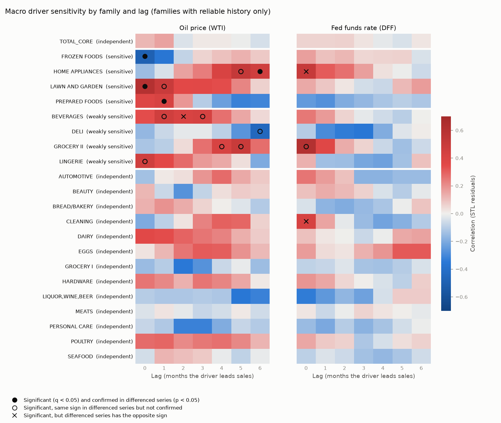

# Macro Driver Findings

## Macro Driver Sensitivity (`07_macro_sensitivity.py`)

Classifies each product family by how its sales relate to the two macro drivers -- the WTI oil price and the US effective federal funds rate (DFF) -- at lags of 0 to 6 months, using the monthly lag correlations from `notebooks/06_macro_driver_analysis.py` (`data/processed/macro_lag_correlations.csv`). Full per-family, per-driver results are in `data/processed/macro_sensitivity_classification.csv`.

### Method and thresholds

- Correlations are computed on two stationary versions of each monthly series (see 06): **STL residuals** (trend and seasonality removed) and **month-over-month changes** (log sales seasonally adjusted, log oil, DFF in percentage points). Raw levels are not used: sales, oil and DFF all trend over 2013-2017, so level correlations (about -0.8 with oil, +0.6 with DFF) mostly reflect shared trends.
- **Sensitive:** at some lag, the STL-residual correlation is significant after false-discovery-rate correction (q < 0.05) **and** the month-over-month correlation at the same lag has the same sign with p < 0.05.
- **Weakly sensitive:** at some lag, the STL-residual correlation has q < 0.05 and the month-over-month correlation has the same sign, but p >= 0.05.
- **Independent:** neither of the above.
- **Insufficient data:** families marked low-confidence or recording-gap-affected in 06; they have at most ~26 usable months, so they are not classified.
- **Strength** is the size of the STL-residual correlation at the best lag: strong |r| >= 0.5, moderate 0.3 <= |r| < 0.5, weak below. The **lag window** is every lag that is significant with the same sign in both transforms.
- A family's overall label is its strongest label across the two drivers. Result: 4 sensitive, 4 weakly sensitive, 14 independent (of 22 series with reliable history, including `TOTAL_CORE`), 12 insufficient data.

### Classification

| Family | Overall | Oil (WTI) | Fed funds rate (DFF) |
|---|---|---|---|
| FROZEN FOODS | sensitive | **sensitive** -- negative, moderate (r = -0.49 at lag 0; lag 0 significant; month-over-month r = -0.32) | independent |
| HOME APPLIANCES | sensitive | **sensitive** -- positive, moderate (r = +0.46 at lag 6; lags 5-6 significant; month-over-month r = +0.35) | independent |
| LAWN AND GARDEN | sensitive | **sensitive** -- positive, strong (r = +0.61 at lag 0; lags 0-1 significant; month-over-month r = +0.35) | independent |
| PREPARED FOODS | sensitive | **sensitive** -- positive, moderate (r = +0.41 at lag 1; lag 1 significant; month-over-month r = +0.30) | independent |
| BEVERAGES | weakly sensitive | **weakly sensitive** -- positive, moderate (r = +0.46 at lag 1; lags 1, 3 significant; month-over-month r = +0.23) | independent |
| DELI | weakly sensitive | **weakly sensitive** -- negative, moderate (r = -0.44 at lag 6; lag 6 significant; month-over-month r = -0.25) | independent |
| GROCERY II | weakly sensitive | **weakly sensitive** -- positive, strong (r = +0.50 at lag 5; lags 4-5 significant; month-over-month r = +0.27) | **weakly sensitive** -- positive, strong (r = +0.62 at lag 0; lag 0 significant; month-over-month r = +0.14) |
| LINGERIE | weakly sensitive | **weakly sensitive** -- positive, moderate (r = +0.46 at lag 0; lag 0 significant; month-over-month r = +0.15) | independent |
| `TOTAL_CORE` | independent | independent | independent |
| AUTOMOTIVE | independent | independent | independent |
| BEAUTY | independent | independent | independent |
| BREAD/BAKERY | independent | independent | independent |
| CLEANING | independent | independent | independent |
| DAIRY | independent | independent | independent |
| EGGS | independent | independent | independent |
| GROCERY I | independent | independent | independent |
| HARDWARE | independent | independent | independent |
| LIQUOR,WINE,BEER | independent | independent | independent |
| MEATS | independent | independent | independent |
| PERSONAL CARE | independent | independent | independent |
| POULTRY | independent | independent | independent |
| SEAFOOD | independent | independent | independent |
| BABY CARE | insufficient data | insufficient data | insufficient data |
| BOOKS | insufficient data | insufficient data | insufficient data |
| CELEBRATION | insufficient data | insufficient data | insufficient data |
| HOME AND KITCHEN I | insufficient data | insufficient data | insufficient data |
| HOME AND KITCHEN II | insufficient data | insufficient data | insufficient data |
| HOME CARE | insufficient data | insufficient data | insufficient data |
| LADIESWEAR | insufficient data | insufficient data | insufficient data |
| MAGAZINES | insufficient data | insufficient data | insufficient data |
| PET SUPPLIES | insufficient data | insufficient data | insufficient data |
| PLAYERS AND ELECTRONICS | insufficient data | insufficient data | insufficient data |
| PRODUCE | insufficient data | insufficient data | insufficient data |
| SCHOOL AND OFFICE SUPPLIES | insufficient data | insufficient data | insufficient data |

### Heatmap

Each cell is the STL-residual correlation between the family's sales in month t and the driver in month t - lag (red = sales rise when the driver rises; blue = sales fall). Filled dots are significant and confirmed by the month-over-month series; open dots are significant with the same sign but not confirmed; x marks are significant on STL residuals but with the opposite sign month-over-month. Families with insufficient data are omitted.

### Which drivers matter

- **Oil price (WTI):** FROZEN FOODS (sensitive, negative, moderate, lag 0); HOME APPLIANCES (sensitive, positive, moderate, lags 5-6); LAWN AND GARDEN (sensitive, positive, strong, lags 0-1); PREPARED FOODS (sensitive, positive, moderate, lag 1); BEVERAGES (weakly sensitive, positive, moderate, lags 1, 3); DELI (weakly sensitive, negative, moderate, lag 6); GROCERY II (weakly sensitive, positive, strong, lags 4-5); LINGERIE (weakly sensitive, positive, moderate, lag 0).
- **Fed funds rate (DFF):** GROCERY II (weakly sensitive, positive, strong, lag 0).
- **`TOTAL_CORE` is independent** of both drivers: no lag is significant for total sales. The sensitive families are small (together 2.2% of sales), and their relationships point in different directions.
- **Direction:** most oil relationships are positive (BEVERAGES, GROCERY II, HOME APPLIANCES, LAWN AND GARDEN, LINGERIE, PREPARED FOODS): sales rise after oil rises. That is consistent with Ecuador being an oil exporter, where higher oil prices mean more income and spending, but this analysis cannot establish cause. Negative: DELI, FROZEN FOODS.

### Caveats

- **Short history:** 55 complete months (2013-01 to 2017-07). Most of the oil variation is a single episode, the 2014-2015 price collapse, so a relationship may reflect that one event rather than a repeatable response.
- **Weak confirmation overall:** on the month-over-month series, no lag correlation survives the false-discovery-rate correction, and fewer reach p < 0.05 than chance alone would produce. Even "sensitive" relationships should be treated as hypotheses to test in a model, not as established effects.
- **DFF barely moves:** it stays near zero until December 2015 and only reaches 1.16% by mid-2017, so there is too little variation to measure interest-rate sensitivity.
- **Conflicting signals** (significant on STL residuals, opposite sign month-over-month), treated as independent: BEVERAGES / Oil price (WTI) (lag 2); CLEANING / Fed funds rate (DFF) (lag 0); HOME APPLIANCES / Fed funds rate (DFF) (lag 0).
- **Excluded families:** the 12 insufficient-data families (the late-launched and recording-gap families, including PRODUCE, ~11% of sales) have at most ~26 usable months and are not classified. Revisit them if more history becomes available.
- **Correlation, not causation:** other factors that moved at the same time (e.g. the April 2016 earthquake, store openings) are not controlled for.

### Recommended lagged macro features

Features should use the **month-over-month change** form, not STL residuals: STL uses a centered smoother that looks at later months, which would leak future information into a forecast. Definitions, on the monthly data in `macro_drivers_merged_monthly.csv`:
- `oil_dlog_lag{k}` = log(oil in month t - k) - log(oil in month t - k - 1), where oil is the monthly mean of observed WTI trading days
- `dff_diff_lag{k}` = DFF in month t - k minus DFF in month t - k - 1, in percentage points
- Do **not** use oil or DFF levels as features: they trend with sales and will produce spurious fits.

**Recommended** (sensitive families; include in the first feature set):

| Family | Driver | Features | Expected sign |
|---|---|---|---|
| FROZEN FOODS | Oil price (WTI) | `oil_dlog_lag0` | negative |
| HOME APPLIANCES | Oil price (WTI) | `oil_dlog_lag5`, `oil_dlog_lag6` | positive |
| LAWN AND GARDEN | Oil price (WTI) | `oil_dlog_lag0`, `oil_dlog_lag1` | positive |
| PREPARED FOODS | Oil price (WTI) | `oil_dlog_lag1` | positive |

**Candidates** (weakly sensitive; keep only if they improve out-of-sample accuracy in backtesting):

| Family | Driver | Features | Expected sign |
|---|---|---|---|
| BEVERAGES | Oil price (WTI) | `oil_dlog_lag1`, `oil_dlog_lag3` | positive |
| DELI | Oil price (WTI) | `oil_dlog_lag6` | negative |
| GROCERY II | Oil price (WTI) | `oil_dlog_lag4`, `oil_dlog_lag5` | positive |
| GROCERY II | Fed funds rate (DFF) | `dff_diff_lag0` | positive |
| LINGERIE | Oil price (WTI) | `oil_dlog_lag0` | positive |

**All features above, combined** (if one shared feature set is used across families): `dff_diff_lag0`, `oil_dlog_lag0`, `oil_dlog_lag1`, `oil_dlog_lag3`, `oil_dlog_lag4`, `oil_dlog_lag5`, `oil_dlog_lag6`. With only 55 months, testing this many features at once risks overfitting, so prefer adding them family by family. For `TOTAL_CORE` and the independent families, no macro features are recommended; seasonality, trend and calendar effects are likely to matter more.

